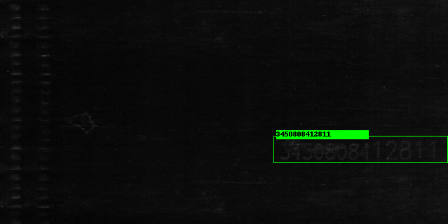

# ADCR
Automatic Detonator Code Recognition via Deep Neural Network.

## Introduction
 This work proposes a pipeline comprising of an SSD-based code localization network and a multi-label code recognition network for the ADCR problem. The former is to locate the region of detonator code, while the latter is to convert the region into strings end-to-end.
 
 Data is avaiable in the followings:
 [Google Drive](https://github.com/wujixiu/ADCR)
 [Baidu Yun](https://pan.baidu.com/s/1BJtfanaMbVu7g3pavMaSxQ)(pwd:n3k4)

 ## Qualitative Results
 
